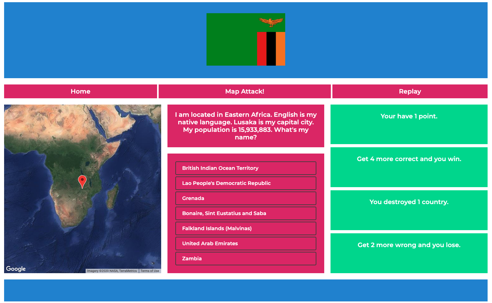
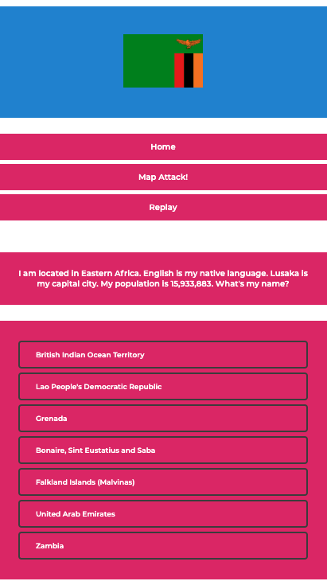
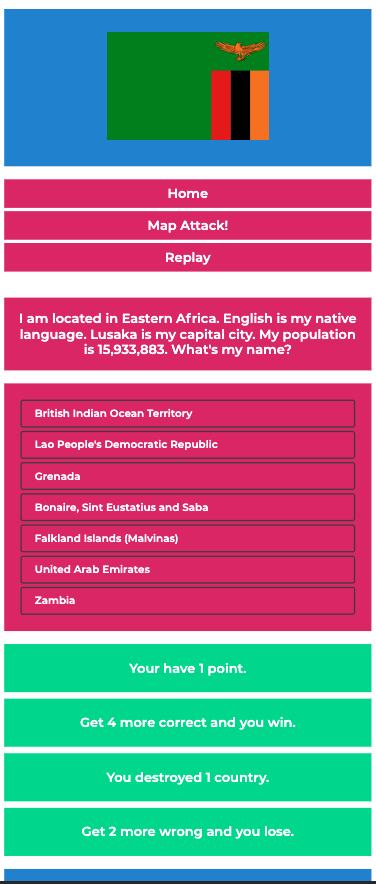

# Map Attack Remastered

### Here's a remastered version of one of my original boot-camp projects named "Map Attack"

Changes made:

1. broke functions down into separate pieces (initially this was all one function that fired first-class functions)

2. Added some logic and fixed singular/plural issues the user sees as interactive feedback

3. Cleaned up the CSS and added CSS variables

4. The game is more responsive now after adding Flexbox and CSS Grid

5. Cleaned up a lot of the HTML element names

If you'd like to clone the game, run "git clone "

Install Node on your machine, you can do that from the command line or directly from [link to Node](https://nodejs.org/en/download/) . There are plenty of resources out there explaining how to install Node on your machine so I'll save myself some time and space here.

Once you clone the repository and install Node, you can run the game locally on a Node.js server by entering "npm run start" in the terminal.

